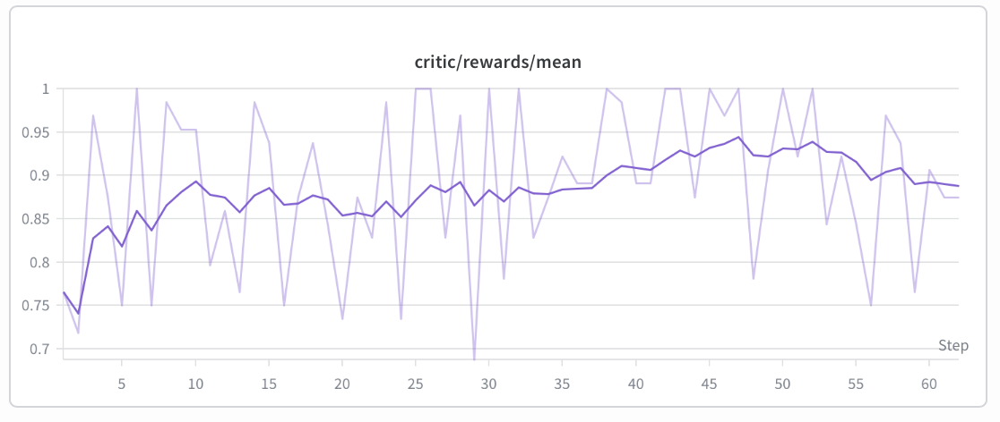

# Qwen3-Omni Thinker GSPO + LoRA Trainer

This example shows how to post-train the **Qwen3-Omni-30B-A3B Thinker** with
**GSPO + LoRA** on a math-reasoning task, using FSDP for the actor and
`vllm-omni` as the async rollout backend.

For the base environment setup, see the [installation guide](../../docs/start/install.md).

## Installation

Follow the [installation guide](../../docs/start/install.md) to set up the base
environment. This recipe was validated on **vllm 0.21.0** (newer than the
version pinned in that guide) with `vllm-omni@main`, so install the following
versions instead:

```bash
# vllm + vllm-omni rollout backend
pip install vllm==0.21.0 --torch-backend=auto
pip install "vllm-omni @ git+https://github.com/vllm-project/vllm-omni.git@main"

# verl (training framework) + verl-omni (this repo)
pip install "verl @ git+https://github.com/verl-project/verl.git@main"
pip install -e .
```

Verify:

```bash
python -c "import verl, verl_omni, vllm, vllm_omni; print('OK')"
```

The provided script is configured for a single node with **4 × H100/H200 80GB**:
the actor (FSDP, 30B + LoRA r=64 with param/optimizer offload) and the
`vllm-omni` rollout (TP=4, `gpu_memory_utilization=0.2`) colocate on the same 4
GPUs. Multi-node is not yet validated.

> `vllm>=0.21` pulls `numpy>=2.x` while verl/verl-omni still pin `numpy<2.0.0`;
> the codepaths used here are numpy-2 compatible, so the pip resolver warning is
> safe to ignore.

## Prepare the dataset

A parquet dataset of math problems with `prompt` and `answer` fields, defaulting
to `~/data/math/{train,test}.parquet`. The example was tested on
`MATH-lighteval`; any standard RL math dataset works. To convert HuggingFace
datasets into verl's parquet format, see
[`verl/examples/data_preprocess/`](https://github.com/verl-project/verl/tree/main/examples/data_preprocess).

```bash
mkdir -p ~/data/math
# … place train.parquet and test.parquet here …
ls ~/data/math/   # train.parquet  test.parquet
```

## Prepare the model

The script uses the HuggingFace Hub ID `Qwen/Qwen3-Omni-30B-A3B-Instruct`
(~60 GB), cached automatically on first run. To use a local copy, set
`MODEL_PATH`:

```bash
export MODEL_PATH=/path/to/local/Qwen3-Omni-30B-A3B-Instruct
```

> **Use the Instruct variant.** The base checkpoint ships no
> `tokenizer.chat_template`; verl's dataset loader calls
> `tokenizer.apply_chat_template(...)` and fails without it.

## Run training

Launch from the repository root:

```bash
bash examples/gspo_trainer/run_qwen3_omni_thinker_gspo_lora.sh
```

Override defaults via env vars or extra Hydra args:

```bash
MODEL_PATH=/local/Qwen3-Omni-30B-A3B-Instruct \
bash examples/gspo_trainer/run_qwen3_omni_thinker_gspo_lora.sh \
    trainer.total_epochs=10 \
    actor_rollout_ref.actor.optim.lr=2e-6
```

To verify the wiring quickly before a full run, see the lightweight tests under
[`tests/workers/rollout/rollout_vllm/`](../../tests/workers/rollout/rollout_vllm/)
(tiny randomly-initialized Qwen3-Omni, no 60 GB download).

## Logging

W&B logging is enabled by default:

```bash
export WANDB_API_KEY=<your_wandb_api_key>
# trainer.project_name / experiment_name are already set in the script
```

## What is trained

Only the **Thinker** (`Qwen3OmniMoeThinkerForConditionalGeneration`):

- LoRA rank 64, alpha 32, on `target_modules="all-linear"`.
- `exclude_modules` strips talker / code2wav / code_predictor / visual /
  audio_tower; `freeze_vision_tower=True` keeps the vision encoder cold.
- The non-Thinker heads are dropped at FSDP-wrap time via `_verl_strip_modules`.

Reward comes from the `dapo` reward manager (math accuracy on parsed answers).

Healthy signals after one full step (~22 min on 4×H100):

- `training/rollout_actor_probs_pearson_corr` > 0.95 (actor ↔ rollout agree
  after weight sync) — the primary correctness signal.
- `actor/loss` ≈ 1e-4…1e-3, `actor/grad_norm` ∈ [1e-3, 1], no OOM
  (`actor/perf/max_memory_allocated_gb` < 60).
- `val-core/.../acc/mean@1` rising with steps.

## Preliminary results

Validation accuracy on MATH-lighteval lands around **0.886** with the default
config. Treat this as a plumbing-correctness signal (finite loss, reasonable
grad norm, rollout↔actor pearson > 0.99, no OOM) rather than evidence the recipe
is tuned — gains are slow because the Instruct base is already a strong
zero-shot solver, LoRA r=64 has limited capacity against a 30B base, and the
binary math reward yields low-variance advantages on a high-baseline policy.



## File map

```
examples/gspo_trainer/
├── run_qwen3_omni_thinker_gspo_lora.sh   ← launch script
├── qwen3_omni_thinker_only.yaml          ← vllm-omni stage config
├── reward.png                            ← preliminary reward curve
└── README.md                             ← (this file)
```
